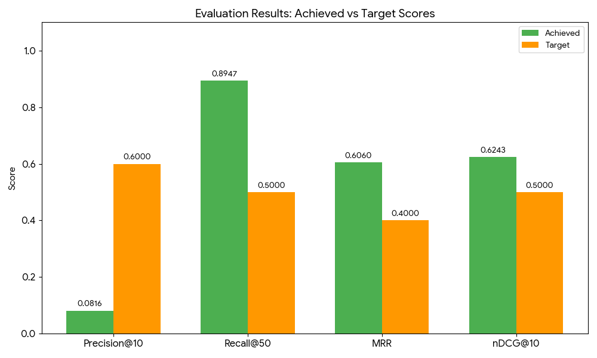

# Multilingual News Search Engine

This project implements a multilingual (English and Bangla) news search engine that supports cross-lingual and code-switched queries. The system combines lexical retrieval (BM25), semantic embeddings, and fuzzy matching to provide robust and accurate information retrieval across languages.

## Project Structure

- `prothom_alo.jsonl` — Bangla news articles (JSONL format)
- `dhaka_tribune.jsonl` — English news articles (JSONL format)
- `Document_Indexing.py` — Builds the search index (BM25, embeddings, metadata)
- `Querying.py` — Handles query normalization, language detection, translation, and entity extraction
- `hybrid_retrival_test.py` — Interactive script to test the hybrid retrieval pipeline
- `Evaluation.py` — Computes evaluation metrics (Precision, Recall, MRR, nDCG)
- `search_index/` — Directory where all indices and models are saved
- `labeled_queries.csv` — Ground-truth dataset containing query–URL relevance pairs
- `Installation_commands.txt` — All required installation commands
- `ARTICLE_SCRAPER/` — Scripts used to scrape news articles

## Getting Started

### 1. Prepare Data

Place your news data in JSONL format. Each line must be a JSON object with at least the following fields:

- `title`
- `body`
- `url`
- `language`

Example files:
- `prothom_alo.jsonl` (Bangla)
- `dhaka_tribune.jsonl` (English)

### 2. Install Dependencies

Run the following commands (see `Installation_commands.txt` for details):

```bash
pip install -r requirements.txt
python -m spacy download en_core_web_sm
```

### 3. Build the Index

Run the indexing script to process your articles and build the search index:

```bash
python Document_Indexing.py
```

This will create the `search_index/` directory containing all necessary index files and models.

## Usage

### Interactive Search

Run the interactive test script to search for news articles using the hybrid retrieval pipeline:

```bash
python hybrid_retrival_test.py
```

### Run Evaluation

To generate evaluation metrics (Precision@10, Recall@50, MRR, nDCG) and view the results:

```bash
python Evaluation.py
```

## Results and Evaluation

This project includes a comprehensive evaluation module to measure the performance of the Cross-Lingual Information Retrieval (CLIR) system.

### Key Findings

- Recall@50: Greater than 0.89 (exceeds target of 0.5)
- MRR: Greater than 0.60 (exceeds target of 0.4)
- Top-10 Success Rate: 81.6% of test queries retrieve the correct relevant document within the top 10 results

### Evidence Files

After running the evaluation and visualization scripts, the following files demonstrate system performance:

| File Name | Description |
|-----------|-------------|
| `Evaluation_Graph.png` | Bar chart comparing achieved scores against assignment targets |
| `Model_Comparison.png` | Comparison showing Hybrid (Lexical + Semantic) outperforming BM25-only and embedding-only models |
| `Recall_Curve.png` | Line graph showing recall performance across different retrieval depths (k = 1 to 50) |
| `labeled_queries.csv` | Ground-truth dataset used for evaluation |

### 📊 Visualizations
Here is the performance of our CLIR system against the target metrics:




## Notes

- Ensure JSONL files are properly formatted and contain both English and Bangla articles for optimal performance.
- The retrieval system maintains a balanced candidate pool across languages.
- All installation commands are listed in `Installation_commands.txt`.

## License

This project is intended for academic and research purposes.
